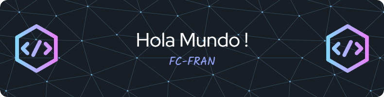

#  Bienvenid@ al GitHub de FC-FRAN 

Hola, soy FC FRAN , un programador apasionado con un gran interés en el aprendizaje de desarrollo de software. Me entusiasma compartir mis proyectos y colaboraciones en GitHub, donde constantemente aprendo y mejoro mis habilidades.

<!-- # 

# 
 -->
<!--
**FCFran/fcfran** is a ✨ _special_ ✨ repository because its `README.md` (this file) appears on your GitHub profile.

Here are some ideas to get you started:

- 🔭 I’m currently working on ...
- 🌱 I’m currently learning ...
- 👯 I’m looking to collaborate on ...
- 🤔 I’m looking for help with ...
- 💬 Ask me about ...
- 📫 How to reach me: ...
- 😄 Pronouns: ...
- ⚡ Fun fact: ...
-->
